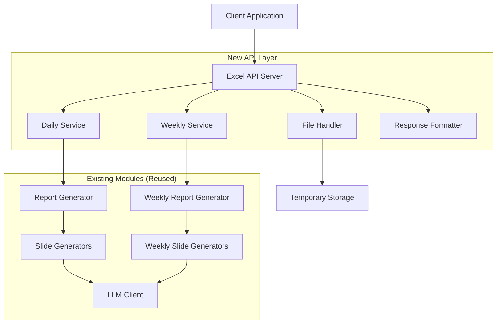
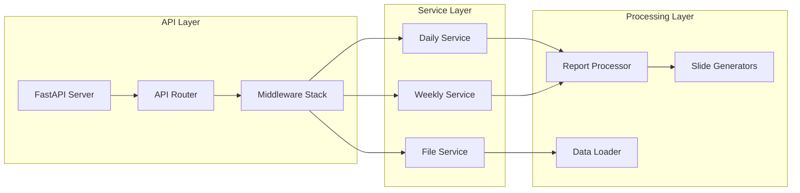

# Design Document: Excel API Upload

## Overview

Tính năng Excel API Upload cung cấp REST API endpoints để upload và xử lý file Excel cho báo cáo daily và weekly. Hệ thống được thiết kế để hoạt động độc lập với Streamlit app hiện tại, tái sử dụng các module xử lý dữ liệu đã có mà không cần thay đổi.

### Key Design Principles

- **Non-disruptive Integration**: API chạy trên port riêng biệt, không ảnh hưởng đến Streamlit app
- **Code Reuse**: Tái sử dụng toàn bộ logic xử lý từ `report_generator.py`, `slide_generators.py`, và các module hiện tại
- **Stateless Design**: Mỗi request được xử lý độc lập, không lưu trữ state giữa các request
- **Security First**: Validate file upload, rate limiting, và secure file handling

## Architecture

### High-Level Architecture



### Service Architecture



## Components and Interfaces

### 1. API Server (FastAPI)

**Responsibility**: HTTP request handling, routing, middleware

```python
class ExcelAPIServer:
    def __init__(self, host: str = "0.0.0.0", port: int = 8001):
        self.app = FastAPI(title="Excel API Upload", version="1.0.0")
        self.host = host
        self.port = port
        
    def setup_routes(self):
        # POST /api/daily/upload
        # POST /api/weekly/upload
        # GET /health
        
    def setup_middleware(self):
        # CORS, rate limiting, logging, error handling
```

### 2. File Handler

**Responsibility**: File upload validation, temporary storage, cleanup

```python
class FileHandler:
    def validate_file(self, file: UploadFile) -> bool:
        # Validate file extension, MIME type, size
        
    def save_temporary_file(self, file: UploadFile) -> str:
        # Save to secure temporary directory
        
    def cleanup_file(self, file_path: str):
        # Delete temporary file
        
    def scan_for_malicious_content(self, file_path: str) -> bool:
        # Basic security scanning
```

### 3. Daily Service

**Responsibility**: Daily report processing logic

```python
class DailyService:
    def __init__(self, api_key: str, base_url: str):
        # Initialize with LLM credentials
        
    def process_daily_report(self, file_path: str, brand_name: str, 
                           report_date: str, report_time: str) -> Dict:
        # Use existing ReportGenerator
        # Calculate 24-hour window
        # Generate 6 slides
        # Return structured data
```

### 4. Weekly Service

**Responsibility**: Weekly report processing logic

```python
class WeeklyService:
    def __init__(self, api_key: str, base_url: str):
        # Initialize with LLM credentials
        
    def process_weekly_report(self, file_path: str, brand_name: str, 
                            report_date: str) -> Dict:
        # Use existing weekly processing logic
        # Calculate weekly window
        # Generate 12 slides
        # Return structured data
```

### 5. Response Formatter

**Responsibility**: Standardize API responses

```python
class ResponseFormatter:
    @staticmethod
    def success_response(data: Dict, processing_time: float, 
                        request_id: str) -> Dict:
        # Format successful response
        
    @staticmethod
    def error_response(error_code: str, message: str, 
                      details: Dict = None) -> Dict:
        # Format error response
```

## Data Models

### Request Models

```python
class DailyUploadRequest(BaseModel):
    brand_name: str = Field(..., min_length=1, max_length=100)
    report_date: str = Field(..., regex=r'^\d{4}-\d{2}-\d{2}$')
    report_time: str = Field(..., regex=r'^\d{2}:\d{2}:\d{2}$')

class WeeklyUploadRequest(BaseModel):
    brand_name: str = Field(..., min_length=1, max_length=100)
    report_date: str = Field(..., regex=r'^\d{4}-\d{2}-\d{2}$')
```

### Response Models

```python
class APIResponse(BaseModel):
    success: bool
    data: Optional[Dict] = None
    error: Optional[Dict] = None
    metadata: Dict = Field(default_factory=dict)

class ProcessingResult(BaseModel):
    prompt_text: str
    slide_data: Dict
    processing_time: float
    request_id: str
    
class ErrorDetail(BaseModel):
    error_code: str
    error_message: str
    details: Optional[Dict] = None
```

### File Upload Models

```python
class FileUploadResult(BaseModel):
    file_path: str
    file_size: int
    file_name: str
    mime_type: str
    is_valid: bool
    validation_errors: List[str] = []
```

## Integration with Existing System

### Code Reuse Strategy

1. **Report Generator**: Sử dụng trực tiếp class `ReportGenerator` từ `report_generator.py`
2. **Slide Generators**: Import và sử dụng tất cả slide generator classes
3. **Data Loader**: Sử dụng `DataLoader` class từ `data_loader.py`
4. **LLM Client**: Sử dụng `LLMClient` từ `llm_client.py`
5. **Configuration**: Sử dụng cùng environment variables và config

### Module Import Structure

```python
# Existing modules (no changes needed)
from report_generator import ReportGenerator
from report_generator_weekly import WeeklyReportGenerator  
from slide_generators import *
from slide_generators_weekly import *
from data_loader import DataLoader
from llm_client import LLMClient
from config import *

# New API modules
from api.server import ExcelAPIServer
from api.services import DailyService, WeeklyService
from api.handlers import FileHandler
from api.formatters import ResponseFormatter
```

### Environment Configuration

API sẽ sử dụng cùng environment variables:
- `API_KEY`: LLM API key
- `BASE_URL`: LLM base URL
- `API_PORT`: API server port (default: 8001)
- `UPLOAD_MAX_SIZE`: Max file size (default: 50MB)
- `TEMP_DIR`: Temporary file directory

## Error Handling

### Error Categories

1. **Validation Errors (400)**
   - Invalid file format
   - Missing required parameters
   - Invalid date format
   - File size exceeded

2. **Processing Errors (500)**
   - Excel parsing failed
   - Data processing failed
   - LLM API errors

3. **Service Errors (503)**
   - LLM API unavailable
   - Temporary service issues

### Error Response Format

```json
{
  "success": false,
  "error": {
    "error_code": "INVALID_FILE_FORMAT",
    "error_message": "File must be Excel format (.xlsx or .xls)",
    "details": {
      "received_format": "pdf",
      "allowed_formats": ["xlsx", "xls"]
    }
  },
  "metadata": {
    "request_id": "req_123456",
    "timestamp": "2024-01-15T10:30:00Z"
  }
}
```

## Testing Strategy

### Unit Testing Approach

- **API Endpoints**: Test request validation, response formatting
- **File Handler**: Test file validation, security checks
- **Services**: Test integration with existing modules
- **Error Handling**: Test all error scenarios

### Integration Testing

- **End-to-End**: Upload file → Process → Return response
- **Performance**: Test with various file sizes and data volumes
- **Concurrent Requests**: Test multiple simultaneous uploads
- **Error Recovery**: Test cleanup after failures

### Property-Based Testing Configuration

Sử dụng `hypothesis` library cho Python:
- Minimum 100 iterations per property test
- Each test tagged with feature reference
- Focus on data validation and processing correctness

## Correctness Properties

*A property is a characteristic or behavior that should hold true across all valid executions of a system-essentially, a formal statement about what the system should do. Properties serve as the bridge between human-readable specifications and machine-verifiable correctness guarantees.*

After analyzing the acceptance criteria, I identified several redundant properties that can be consolidated:
- Properties 2.1 and 8.1 both test file format validation - combined into Property 1
- Properties 2.5 and 8.5 both test file cleanup - combined into Property 2  
- Properties 3.5 and 4.5 both test response formatting - combined into Property 15

### Property 1: File Format Validation

*For any* uploaded file, the File_Handler should accept the file if and only if it has a valid Excel format (xlsx or xls) and appropriate MIME type.

**Validates: Requirements 2.1, 8.1**

### Property 2: Secure File Lifecycle Management

*For any* uploaded file, the File_Handler should create temporary files in a secure directory with restricted permissions and automatically delete them after processing completion or timeout.

**Validates: Requirements 2.5, 8.5**

### Property 3: File Size Validation

*For any* uploaded file, if the file size exceeds 50MB, the File_Handler should reject the file and return an appropriate error message.

**Validates: Requirements 2.2**

### Property 4: Required Column Validation

*For any* Excel file, the File_Handler should validate that all required columns exist before processing.

**Validates: Requirements 2.3**

### Property 5: Multipart Form Data Acceptance

*For any* valid Excel file upload, the Excel_API_System should accept multipart/form-data requests with the file and required parameters.

**Validates: Requirements 1.3, 1.4**

### Property 6: Invalid Parameter Error Handling

*For any* request with invalid parameters, the Excel_API_System should return HTTP 400 with descriptive error messages that specify what was invalid.

**Validates: Requirements 1.5, 2.4**

### Property 7: Daily Time Window Calculation

*For any* valid report_date and report_time parameters, the Daily_Processor should calculate a 24-hour window ending at the specified datetime.

**Validates: Requirements 3.2**

### Property 8: Daily Slide Generation

*For any* valid daily processing request, the Daily_Processor should generate exactly 6 slides with the specified types: overview, trendline, channels, sentiment, top posts, and deleted posts.

**Validates: Requirements 3.3**

### Property 9: Weekly Time Window Calculation

*For any* valid report_date parameter, the Weekly_Processor should calculate a weekly window based on the specified date.

**Validates: Requirements 4.2**

### Property 10: Weekly Slide Generation

*For any* valid weekly processing request, the Weekly_Processor should generate exactly 12 slides for the weekly report.

**Validates: Requirements 4.3**

### Property 11: Processing Logic Reuse

*For any* valid request, both Daily_Processor and Weekly_Processor should use the existing processing modules without modification to generate results.

**Validates: Requirements 3.1, 4.1**

### Property 12: Prompt Generation Completeness

*For any* successfully processed data (daily or weekly), the Prompt_Generator should create complete prompt text that includes all slide information.

**Validates: Requirements 3.4, 4.4**

### Property 13: System Isolation

*For any* API server state (running or failed), the Streamlit application should continue to function normally without interference.

**Validates: Requirements 5.3, 5.5**

### Property 14: Configuration Consistency

*For any* environment variable used by the Streamlit application, the Excel_API_System should use the same variable and value.

**Validates: Requirements 5.4**

### Property 15: Response Format Consistency

*For any* API response (success or error), the Response_Formatter should return JSON with consistent structure including appropriate fields and Content-Type headers.

**Validates: Requirements 3.5, 4.5, 7.1, 7.2, 7.3, 7.4, 7.5**

### Property 16: Error Status Code Mapping

*For any* processing error condition, the Excel_API_System should return the appropriate HTTP status code (400 for validation errors, 500 for processing errors, 503 for service unavailability).

**Validates: Requirements 6.1, 6.3**

### Property 17: Comprehensive Request Logging

*For any* API request, the Excel_API_System should log the request with timestamp, file information, and processing status.

**Validates: Requirements 6.2**

### Property 18: Graceful Timeout Handling

*For any* timeout scenario during processing, the Excel_API_System should handle it gracefully and return appropriate error responses.

**Validates: Requirements 6.4**

### Property 19: Detailed Error Messages

*For any* error condition, the Excel_API_System should provide detailed error messages that include sufficient information for debugging.

**Validates: Requirements 6.5**

### Property 20: Malicious Content Detection

*For any* uploaded file, the File_Handler should scan for malicious content and reject files that contain security threats.

**Validates: Requirements 8.2**

### Property 21: Rate Limiting Enforcement

*For any* sequence of upload requests from the same source, the Excel_API_System should enforce rate limiting and reject excessive requests.

**Validates: Requirements 8.3**

### Property 22: Secure File Storage

*For any* temporary file created during processing, the File_Handler should store it in a secure directory with restricted permissions.

**Validates: Requirements 8.4**

## Error Handling

### Error Classification and Response Strategy

The system implements a comprehensive error handling strategy with clear error categories and consistent response formats:

1. **Client Errors (4xx)**
   - 400 Bad Request: Invalid parameters, file format, or validation failures
   - 413 Payload Too Large: File size exceeds limits
   - 429 Too Many Requests: Rate limiting triggered

2. **Server Errors (5xx)**
   - 500 Internal Server Error: Processing failures, unexpected errors
   - 503 Service Unavailable: LLM API unavailable, temporary service issues

3. **Error Response Structure**
   - Consistent JSON format with error_code, error_message, and details
   - Request tracking with request_id and timestamp
   - Detailed debugging information for development

### Error Recovery and Cleanup

- Automatic cleanup of temporary files on any error condition
- Graceful degradation when external services are unavailable
- Retry mechanisms for transient failures
- Comprehensive logging for error analysis and debugging

## Testing Strategy

### Dual Testing Approach

The testing strategy combines unit tests for specific scenarios with property-based tests for comprehensive coverage:

**Unit Tests Focus:**
- Specific API endpoint examples (GET /health, POST /api/daily/upload)
- Edge cases like exactly 50MB file size
- Integration points between API and existing modules
- Error condition examples (malformed JSON, missing files)

**Property-Based Tests Focus:**
- Universal properties across all inputs using `hypothesis` library
- File validation across various file types and sizes
- Parameter validation across all possible input combinations
- Response format consistency across all scenarios

### Property-Based Testing Configuration

Using `hypothesis` library for Python:
- Minimum 100 iterations per property test
- Each test tagged with feature reference: **Feature: excel-api-upload, Property {number}: {property_text}**
- Custom generators for Excel files, API requests, and error conditions
- Comprehensive input coverage through randomization

### Test Categories

1. **API Contract Tests**: Verify endpoint availability and request/response formats
2. **File Processing Tests**: Validate file handling, security, and cleanup
3. **Integration Tests**: Test interaction with existing processing modules
4. **Performance Tests**: Verify handling of large files and concurrent requests
5. **Security Tests**: Validate file scanning, rate limiting, and secure storage
6. **Error Handling Tests**: Comprehensive error scenario coverage

Each correctness property will be implemented as a single property-based test with appropriate generators and assertions to verify the universal behavior across all valid inputs.